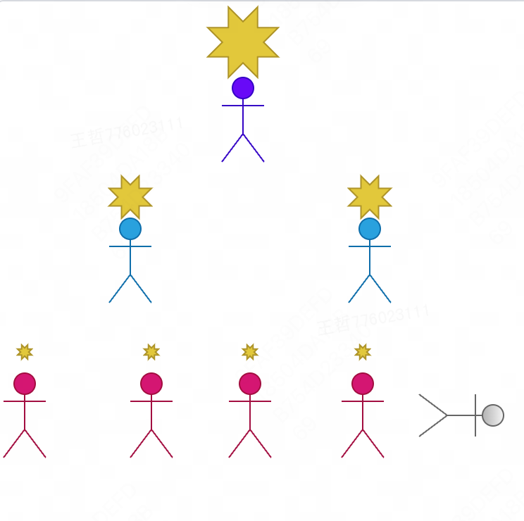
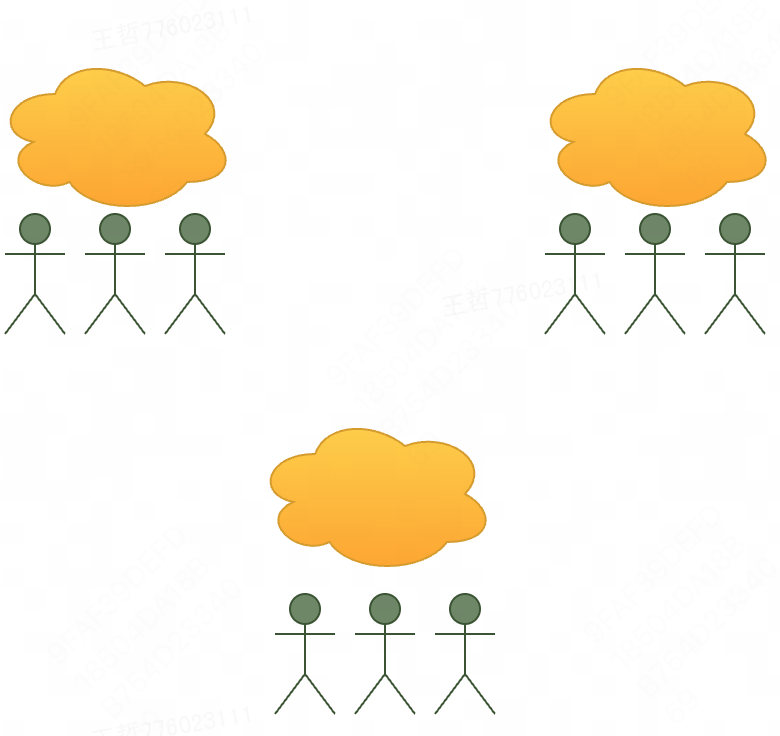
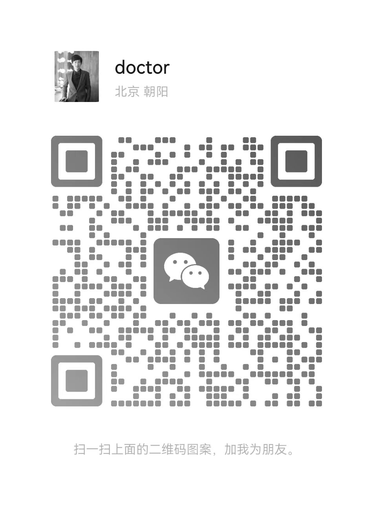

# 去中心化软件组织

> 生命漫长又短暂，请尽情享受这个世界的美好，激发你的无限创造力，我们为你提供无限制的工作机会，无关乎你的任何社会条件。

## 运作模式

1. 各种形式的与客户确认合作事宜
2. 客户托管需求和资金到 FW，任何来源的需求均需进行托管，反对通过 FW 接项目自己组件外部团队开发，这不符合我们的价值观(为什么要这样，一是防止 BD 对于资金的隐瞒，违规平等的价值观；二是防止 BD 跑路)
3. 团队组合(组织成员公开自己的状态，通过邀约方式完成组队)，确认分配方案，确认开发计划
4. 开发过程管理,也是我们的核心步骤之一，侧重过程，动态调整
5. 完成交付
6. 项目归档，项目持续收益仍然按照分配方案占比进行分配

## 我们的价值观

> 如果完全认同我们的价值观，请加入

- 健康：拥有健康的身体，有时间去陪伴家人朋友
- 透明：抹除信息不对称
- 平等：按劳动分配，反对剩余价值榨取
- 自由：分布式办公
- 可持续：拥有劳动产物的所有权

## 反对

> 反对任何目的的利用别人为自己获得价值

## 破局

> 通过管道连接，源源不断的引入需求，自由组合完成需求

## 加入

 
